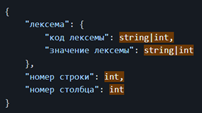

## 
Требования к продукту

 

<i>Транслятор из Pascal в C#</i>

 

### **История изменений документа**

| **Дата**   | **Автор**     | **Внесенные изменения**                                                     |
|------------|---------------|-----------------------------------------------------------------------------|
| 27.20.2022 | А.А. Аликаева | Исходная версия требований                                                  |
| 31.10.2022 | А.А. Аликаева | Добавлены требования к подсистемам сематический анализатор и генератор кода |

Программный продукт _Транслятор из Pascal в C#_ предназначен для трансляции программного кода из языка Pascal в язык C#.

Программный продукт _Транслятор из Pascal в C#_ состоит из следующих подсистем:

1. Пользовательский интерфейс
2. Лексический анализатор
3. Синтаксический анализатор
4. Семантический анализатор
5. Генератор кода

### **Требования к подсистеме «Пользовательский интерфейс»**

<u>Требование REQ_UI_001</u>  
&nbsp;&nbsp;&nbsp;&nbsp;&nbsp;&nbsp;Пользовательский интерфейс содержит два окна: окно ввода и окно вывода. Окно ввода принимает текст программы на языке Pascal. Окно вывода отображает текст программы на языке C#.

<u>Требование REQ_UI_002</u>  
&nbsp;&nbsp;&nbsp;&nbsp;&nbsp;&nbsp;В случае некорректной работы программы в окне вывода отображается сообщение об ошибке.

<u>Требование REQ_UI_003</u>  
&nbsp;&nbsp;&nbsp;&nbsp;&nbsp;&nbsp;При нажатии на кнопку «Выберите файл» пользователь выбирает файл формата «.txt» или «.pas», содержащий код программы на языке Pascal. Название выбранного файла отображается справа от кнопки, а его содержимое представлено в окне ввода. 

<u>Требование REQ_UI_004</u>  
&nbsp;&nbsp;&nbsp;&nbsp;&nbsp;&nbsp;При нажатии на кнопку «Download» пользователь сохраняет на устройство файл формата «.cs», содержащий код программы на языке C#. Если окно вывода пустое или содержит ошибку, кнопка неактивна.

<u>Требование REQ_UI_005</u>  
&nbsp;&nbsp;&nbsp;&nbsp;&nbsp;&nbsp;Пользовательский интерфейс содержит кнопку «Transpile», при нажатии на которую происходит трансляция кода из Pascal в C#.

<u>Требование REQ_UI_006</u>  
&nbsp;&nbsp;&nbsp;&nbsp;&nbsp;&nbsp;Пользовательский интерфейс содержит кнопку «Clear», при нажатии на которую происходит очистка окна ввода и в случае, если код был вставлен из файла, очищается и строка с названием файла справа от кнопки «Выберите файл».

### **Требования к подсистеме «Лексический анализатор»**

<u>Требование REQ_LA_001</u>  
&nbsp;&nbsp;&nbsp;&nbsp;&nbsp;&nbsp;На вход поступает код программы на языке Pascal. На выходе получаем множество токенов, иначе, если анализатор обнаружил ошибки, то программа уведомляет об этом.  
&nbsp;&nbsp;&nbsp;&nbsp;&nbsp;&nbsp;Структура токена представлена на Рис. 1.  

 
Рис. 1

### **Требования к подсистеме «Синтаксический анализатор»**

<u>Требование REQ_SYNA_001</u>  
&nbsp;&nbsp;&nbsp;&nbsp;&nbsp;&nbsp;На вход поступает массив токенов, полученный в результате лексического анализа. На выходе получаем CST (конкретное синтаксическое дерево), или сообщение об ошибке, если такова была обнаружена. 

### **Требования к подсистеме «Семантический анализатор»**

<u>Требование REQ_SEMA_001</u>  
&nbsp;&nbsp;&nbsp;&nbsp;&nbsp;&nbsp;На вход поступает дерево разбора, полученное от синтаксического анализатора. На выходе получаем дерево, проверенное на семантические ошибки, а если таковы есть, то выводится сообщение об ошибке. 

### **Требования к подсистеме «Генератор кода»**

<u>Требование REQ_CG_001</u>  
&nbsp;&nbsp;&nbsp;&nbsp;&nbsp;&nbsp;На вход поступает дерево разбора, полученное от семантического анализатора. На выходе получаем код программы на языке C#.